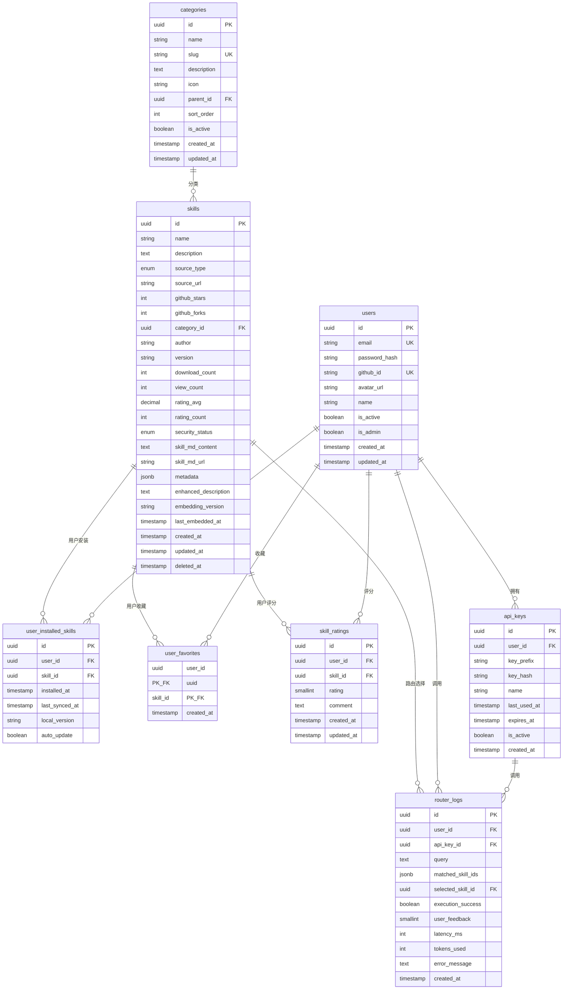

# SkillHub Pro 数据库设计文档

## 文档信息

| 项目       | 内容                                   |
| ---------- | -------------------------------------- |
| 项目名称   | SkillHub Pro（技能宝库）               |
| 文档类型   | 数据库设计说明书                       |
| 版本       | V1.0                                   |
| 创建日期   | 2026-04-23                             |
| 数据库系统 | PostgreSQL 15+                         |
| ORM 框架   | XORM                                   |
| 参考文档   | PRD V3.0、概要设计 V1.0、详细设计 V1.1 |


## 1. 概述

### 1.1 目的

本文档定义 SkillHub Pro 系统的数据库设计，包括数据模型、表结构、字段说明、索引策略和约束关系，为后端开发和数据库运维提供依据。

### 1.2 设计原则

- **规范化**：遵循第三范式（3NF），避免数据冗余。
- **可扩展**：关键实体使用 UUID 主键，支持分布式环境。
- **性能优先**：对高频查询字段建立索引，合理使用 JSONB 字段存储半结构化数据。
- **软删除**：核心业务表支持软删除，保留数据可追溯性。

### 1.3 命名规范

| 对象类型 | 命名规则               | 示例                         |
| -------- | ---------------------- | ---------------------------- |
| 表名     | 小写蛇形命名，复数形式 | `skills`, `categories`       |
| 字段名   | 小写蛇形命名           | `created_at`, `github_stars` |
| 主键     | `id`                   | `id UUID PRIMARY KEY`        |
| 外键     | `{关联表单数}_id`      | `category_id`, `user_id`     |
| 索引     | `idx_{表名}_{字段名}`  | `idx_skills_category`        |
| 唯一约束 | `uq_{表名}_{字段名}`   | `uq_users_email`             |


## 2. 数据库选型与配置

### 2.1 数据库系统

- **主数据库**：PostgreSQL 15+
- **选型理由**：
  - 原生支持 UUID 类型
  - 强大的 JSONB 支持，便于存储技能元数据
  - 成熟的事务处理和并发控制
  - 丰富的索引类型（B-Tree、GIN、GiST）

### 2.2 推荐配置

| 参数                   | 建议值     | 说明              |
| ---------------------- | ---------- | ----------------- |
| `max_connections`      | 200        | 根据并发量调整    |
| `shared_buffers`       | 25% RAM    | 内存的 25%        |
| `effective_cache_size` | 50-75% RAM | 查询规划优化      |
| `work_mem`             | 16-64MB    | 排序/哈希操作内存 |
| `maintenance_work_mem` | 256MB      | VACUUM 等维护操作 |

### 2.3 扩展依赖

```sql
-- 启用 UUID 生成函数
CREATE EXTENSION IF NOT EXISTS "uuid-ossp";

-- 如需全文检索增强（可选，项目使用 Meilisearch 故非必须）
-- CREATE EXTENSION IF NOT EXISTS "pg_trgm";
```


## 3. 实体关系图（ER 图）




## 4. 详细表结构

### 4.1 分类表 `categories`

技能所属的分类，支持树形结构。

| 字段名        | 数据类型                 | 约束                                         | 默认值              | 说明                               |
| ------------- | ------------------------ | -------------------------------------------- | ------------------- | ---------------------------------- |
| `id`          | UUID                     | PRIMARY KEY                                  | `gen_random_uuid()` | 分类唯一标识                       |
| `name`        | VARCHAR(100)             | NOT NULL                                     | -                   | 分类名称                           |
| `slug`        | VARCHAR(100)             | UNIQUE NOT NULL                              | -                   | URL 友好标识（如 `data-analysis`） |
| `description` | TEXT                     | -                                            | -                   | 分类描述                           |
| `icon`        | VARCHAR(50)              | -                                            | -                   | 图标名称（如 `database`）          |
| `parent_id`   | UUID                     | REFERENCES categories(id) ON DELETE SET NULL | NULL                | 父分类 ID，支持层级                |
| `sort_order`  | INT                      | -                                            | 0                   | 显示排序权重                       |
| `is_active`   | BOOLEAN                  | -                                            | true                | 是否启用                           |
| `created_at`  | TIMESTAMP WITH TIME ZONE | -                                            | NOW()               | 创建时间                           |
| `updated_at`  | TIMESTAMP WITH TIME ZONE | -                                            | NOW()               | 更新时间                           |

**索引**：
- `idx_categories_parent` ON (parent_id)
- `idx_categories_slug` ON (slug) — 已有唯一约束自动创建索引
- `idx_categories_sort` ON (sort_order)

---

### 4.2 技能表 `skills`

核心业务表，存储技能的全部信息。

| 字段名                 | 数据类型                 | 约束                                         | 默认值              | 说明                                               |
| ---------------------- | ------------------------ | -------------------------------------------- | ------------------- | -------------------------------------------------- |
| `id`                   | UUID                     | PRIMARY KEY                                  | `gen_random_uuid()` | 技能唯一标识                                       |
| `name`                 | VARCHAR(255)             | NOT NULL                                     | -                   | 技能名称                                           |
| `description`          | TEXT                     | -                                            | -                   | 技能简介（来自 frontmatter）                       |
| `source_type`          | VARCHAR(50)              | CHECK                                        | -                   | 来源类型：`official`、`github`、`community`        |
| `source_url`           | VARCHAR(500)             | -                                            | -                   | 来源仓库 URL                                       |
| `github_stars`         | INT                      | -                                            | 0                   | GitHub 星数                                        |
| `github_forks`         | INT                      | -                                            | 0                   | GitHub 复刻数                                      |
| `category_id`          | UUID                     | REFERENCES categories(id) ON DELETE SET NULL | NULL                | 所属分类 ID                                        |
| `author`               | VARCHAR(255)             | -                                            | -                   | 作者名称                                           |
| `version`              | VARCHAR(50)              | -                                            | -                   | 技能版本号                                         |
| `download_count`       | INT                      | -                                            | 0                   | 总下载/安装次数                                    |
| `view_count`           | INT                      | -                                            | 0                   | 详情页浏览量                                       |
| `rating_avg`           | DECIMAL(2,1)             | CHECK (rating_avg BETWEEN 1 AND 5)           | NULL                | 平均评分                                           |
| `rating_count`         | INT                      | -                                            | 0                   | 评分总人数                                         |
| `security_status`      | VARCHAR(20)              | CHECK                                        | 'pending'           | 安全状态：`pending`、`scanning`、`safe`、`warning` |
| `skill_md_content`     | TEXT                     | -                                            | -                   | SKILL.md 文件原始内容（可选，用于预览）            |
| `skill_md_url`         | VARCHAR(500)             | -                                            | -                   | 对象存储中 SKILL.md 的访问 URL                     |
| `metadata`             | JSONB                    | -                                            | -                   | 从 YAML frontmatter 解析的原始元数据               |
| `enhanced_description` | TEXT                     | -                                            | -                   | LLM 生成的增强描述，用于向量检索                   |
| `embedding_version`    | VARCHAR(20)              | -                                            | -                   | 向量化使用的模型版本                               |
| `last_embedded_at`     | TIMESTAMP WITH TIME ZONE | -                                            | -                   | 最近一次向量化的时间                               |
| `created_at`           | TIMESTAMP WITH TIME ZONE | -                                            | NOW()               | 创建时间                                           |
| `updated_at`           | TIMESTAMP WITH TIME ZONE | -                                            | NOW()               | 更新时间                                           |
| `deleted_at`           | TIMESTAMP WITH TIME ZONE | -                                            | -                   | 软删除时间（NULL 表示未删除）                      |

**CHECK 约束定义**：
```sql
ALTER TABLE skills ADD CONSTRAINT check_source_type 
    CHECK (source_type IN ('official', 'github', 'community'));
ALTER TABLE skills ADD CONSTRAINT check_security_status 
    CHECK (security_status IN ('pending', 'scanning', 'safe', 'warning'));
```

**索引**：
- `idx_skills_category` ON (category_id) — 分类查询
- `idx_skills_stars` ON (github_stars DESC) — 热门排序
- `idx_skills_source` ON (source_type) — 按来源筛选
- `idx_skills_security` ON (security_status) — 安全筛选
- `idx_skills_created` ON (created_at DESC) — 最新技能
- `idx_skills_updated` ON (updated_at DESC) — 最近更新
- `idx_skills_deleted` ON (deleted_at) — 软删除过滤
- `idx_skills_download` ON (download_count DESC) — 热门下载

**GIN 索引（JSONB 查询优化）**：
```sql
CREATE INDEX idx_skills_metadata ON skills USING gin (metadata);
```

---

### 4.3 用户表 `users`

存储平台注册用户信息。

| 字段名          | 数据类型                 | 约束        | 默认值              | 说明                    |
| --------------- | ------------------------ | ----------- | ------------------- | ----------------------- |
| `id`            | UUID                     | PRIMARY KEY | `gen_random_uuid()` | 用户唯一标识            |
| `email`         | VARCHAR(255)             | UNIQUE      | -                   | 邮箱地址（用于登录）    |
| `password_hash` | VARCHAR(255)             | -           | -                   | bcrypt 加密后的密码哈希 |
| `github_id`     | VARCHAR(100)             | UNIQUE      | -                   | GitHub OAuth 用户 ID    |
| `avatar_url`    | VARCHAR(500)             | -           | -                   | 头像 URL                |
| `name`          | VARCHAR(100)             | -           | -                   | 显示名称                |
| `is_active`     | BOOLEAN                  | -           | true                | 账号是否激活            |
| `is_admin`      | BOOLEAN                  | -           | false               | 是否管理员              |
| `created_at`    | TIMESTAMP WITH TIME ZONE | -           | NOW()               | 注册时间                |
| `updated_at`    | TIMESTAMP WITH TIME ZONE | -           | NOW()               | 更新时间                |

**索引**：
- `idx_users_email` ON (email) — 邮箱登录
- `idx_users_github_id` ON (github_id) — OAuth 登录
- `idx_users_created` ON (created_at) — 统计

---

### 4.4 API 密钥表 `api_keys`

存储用户生成的 API 密钥，用于程序化调用。

| 字段名         | 数据类型                 | 约束                                            | 默认值              | 说明                                   |
| -------------- | ------------------------ | ----------------------------------------------- | ------------------- | -------------------------------------- |
| `id`           | UUID                     | PRIMARY KEY                                     | `gen_random_uuid()` | 密钥唯一标识                           |
| `user_id`      | UUID                     | NOT NULL REFERENCES users(id) ON DELETE CASCADE | -                   | 所属用户 ID                            |
| `key_prefix`   | VARCHAR(20)              | NOT NULL                                        | -                   | 密钥前缀（如 `sk_****abcd`），用于展示 |
| `key_hash`     | VARCHAR(255)             | NOT NULL                                        | -                   | SHA256(完整密钥) 哈希值，用于验证      |
| `name`         | VARCHAR(100)             | -                                               | -                   | 密钥备注名称                           |
| `last_used_at` | TIMESTAMP WITH TIME ZONE | -                                               | -                   | 最近使用时间                           |
| `expires_at`   | TIMESTAMP WITH TIME ZONE | -                                               | -                   | 过期时间（NULL 表示永不过期）          |
| `is_active`    | BOOLEAN                  | -                                               | true                | 是否启用                               |
| `created_at`   | TIMESTAMP WITH TIME ZONE | -                                               | NOW()               | 创建时间                               |

**索引**：
- `idx_api_keys_user` ON (user_id)
- `idx_api_keys_hash` ON (key_hash) — 验证查询

---

### 4.5 用户安装技能表 `user_installed_skills`

记录用户通过 VS Code 插件安装的技能，用于跨设备同步。

| 字段名           | 数据类型                 | 约束                                             | 默认值              | 说明             |
| ---------------- | ------------------------ | ------------------------------------------------ | ------------------- | ---------------- |
| `id`             | UUID                     | PRIMARY KEY                                      | `gen_random_uuid()` | 记录唯一标识     |
| `user_id`        | UUID                     | NOT NULL REFERENCES users(id) ON DELETE CASCADE  | -                   | 用户 ID          |
| `skill_id`       | UUID                     | NOT NULL REFERENCES skills(id) ON DELETE CASCADE | -                   | 技能 ID          |
| `installed_at`   | TIMESTAMP WITH TIME ZONE | -                                                | NOW()               | 首次安装时间     |
| `last_synced_at` | TIMESTAMP WITH TIME ZONE | -                                                | NOW()               | 最近同步时间     |
| `local_version`  | VARCHAR(50)              | -                                                | -                   | 本地安装的版本号 |
| `auto_update`    | BOOLEAN                  | -                                                | true                | 是否自动更新     |

**约束**：
- `uq_user_installed` UNIQUE (user_id, skill_id) — 同一用户不可重复安装同一技能

**索引**：
- `idx_user_installed_user` ON (user_id)

---

### 4.6 用户收藏表 `user_favorites`

记录用户收藏的技能。

| 字段名       | 数据类型                 | 约束                                             | 默认值 | 说明     |
| ------------ | ------------------------ | ------------------------------------------------ | ------ | -------- |
| `user_id`    | UUID                     | NOT NULL REFERENCES users(id) ON DELETE CASCADE  | -      | 用户 ID  |
| `skill_id`   | UUID                     | NOT NULL REFERENCES skills(id) ON DELETE CASCADE | -      | 技能 ID  |
| `created_at` | TIMESTAMP WITH TIME ZONE | -                                                | NOW()  | 收藏时间 |

**主键**：`PRIMARY KEY (user_id, skill_id)`

**索引**：
- `idx_favorites_skill` ON (skill_id) — 查询某技能被收藏数

---

### 4.7 技能评分表 `skill_ratings`

用户对技能的打分和评论。

| 字段名       | 数据类型                 | 约束                                             | 默认值              | 说明           |
| ------------ | ------------------------ | ------------------------------------------------ | ------------------- | -------------- |
| `id`         | UUID                     | PRIMARY KEY                                      | `gen_random_uuid()` | 评分唯一标识   |
| `user_id`    | UUID                     | NOT NULL REFERENCES users(id) ON DELETE CASCADE  | -                   | 用户 ID        |
| `skill_id`   | UUID                     | NOT NULL REFERENCES skills(id) ON DELETE CASCADE | -                   | 技能 ID        |
| `rating`     | SMALLINT                 | CHECK (rating BETWEEN 1 AND 5)                   | -                   | 评分（1-5 星） |
| `comment`    | TEXT                     | -                                                | -                   | 评论内容       |
| `created_at` | TIMESTAMP WITH TIME ZONE | -                                                | NOW()               | 创建时间       |
| `updated_at` | TIMESTAMP WITH TIME ZONE | -                                                | NOW()               | 更新时间       |

**约束**：
- `uq_user_skill_rating` UNIQUE (user_id, skill_id) — 每个用户对每个技能只能有一个评分

**索引**：
- `idx_ratings_skill` ON (skill_id)
- `idx_ratings_user` ON (user_id)

---

### 4.8 路由日志表 `router_logs`

记录智能路由的每次调用，用于分析匹配效果和成本控制。

| 字段名              | 数据类型                 | 约束                                       | 默认值              | 说明                               |
| ------------------- | ------------------------ | ------------------------------------------ | ------------------- | ---------------------------------- |
| `id`                | UUID                     | PRIMARY KEY                                | `gen_random_uuid()` | 日志唯一标识                       |
| `user_id`           | UUID                     | REFERENCES users(id) ON DELETE SET NULL    | NULL                | 调用用户 ID                        |
| `api_key_id`        | UUID                     | REFERENCES api_keys(id) ON DELETE SET NULL | NULL                | 使用的 API Key ID                  |
| `query`             | TEXT                     | NOT NULL                                   | -                   | 用户输入的自然语言查询             |
| `matched_skill_ids` | JSONB                    | -                                          | -                   | 初步匹配到的技能 ID 列表（含分数） |
| `selected_skill_id` | UUID                     | REFERENCES skills(id) ON DELETE SET NULL   | NULL                | 最终选择执行的技能 ID              |
| `execution_success` | BOOLEAN                  | -                                          | -                   | 执行是否成功                       |
| `user_feedback`     | SMALLINT                 | CHECK (user_feedback BETWEEN 1 AND 5)      | NULL                | 用户反馈评分                       |
| `latency_ms`        | INT                      | -                                          | -                   | 整体耗时（毫秒）                   |
| `tokens_used`       | INT                      | -                                          | -                   | 消耗的 token 数量                  |
| `error_message`     | TEXT                     | -                                          | -                   | 错误信息（如有）                   |
| `created_at`        | TIMESTAMP WITH TIME ZONE | -                                          | NOW()               | 记录时间                           |

**索引**：
- `idx_router_logs_user` ON (user_id)
- `idx_router_logs_created` ON (created_at DESC)
- `idx_router_logs_api_key` ON (api_key_id)
- `idx_router_logs_selected_skill` ON (selected_skill_id)

---

### 4.9 同步任务表 `sync_tasks`

记录后台技能同步任务的状态和结果。

| 字段名            | 数据类型                 | 约束        | 默认值              | 说明                                                   |
| ----------------- | ------------------------ | ----------- | ------------------- | ------------------------------------------------------ |
| `id`              | UUID                     | PRIMARY KEY | `gen_random_uuid()` | 任务唯一标识                                           |
| `task_type`       | VARCHAR(50)              | NOT NULL    | -                   | 任务类型：`official_sync`、`github_discover`、`manual` |
| `status`          | VARCHAR(20)              | -           | 'pending'           | 状态：`pending`、`running`、`completed`、`failed`      |
| `total_repos`     | INT                      | -           | 0                   | 待处理仓库总数                                         |
| `processed_repos` | INT                      | -           | 0                   | 已处理仓库数                                           |
| `new_skills`      | INT                      | -           | 0                   | 新增技能数                                             |
| `updated_skills`  | INT                      | -           | 0                   | 更新技能数                                             |
| `error_log`       | TEXT                     | -           | -                   | 错误日志概要                                           |
| `started_at`      | TIMESTAMP WITH TIME ZONE | -           | -                   | 开始时间                                               |
| `completed_at`    | TIMESTAMP WITH TIME ZONE | -           | -                   | 完成时间                                               |
| `created_at`      | TIMESTAMP WITH TIME ZONE | -           | NOW()               | 创建时间                                               |

**索引**：
- `idx_sync_tasks_status` ON (status)
- `idx_sync_tasks_created` ON (created_at DESC)


## 5. 视图设计（可选）

为简化统计查询，可创建以下视图。

### 5.1 技能热门榜视图 `v_popular_skills`

```sql
CREATE VIEW v_popular_skills AS
SELECT 
    id,
    name,
    description,
    github_stars,
    download_count,
    rating_avg,
    (github_stars * 0.5 + download_count * 0.3 + COALESCE(rating_avg, 0) * 10 * 0.2) AS hot_score
FROM skills
WHERE deleted_at IS NULL AND security_status = 'safe'
ORDER BY hot_score DESC;
```

### 5.2 用户技能统计视图 `v_user_stats`

```sql
CREATE VIEW v_user_stats AS
SELECT 
    u.id AS user_id,
    COUNT(DISTINCT i.skill_id) AS installed_count,
    COUNT(DISTINCT f.skill_id) AS favorite_count,
    COUNT(DISTINCT r.id) AS rating_count
FROM users u
LEFT JOIN user_installed_skills i ON u.id = i.user_id
LEFT JOIN user_favorites f ON u.id = f.user_id
LEFT JOIN skill_ratings r ON u.id = r.user_id
GROUP BY u.id;
```


## 6. 数据字典

### 6.1 枚举值说明

#### `skills.source_type`
| 值          | 含义                           |
| ----------- | ------------------------------ |
| `official`  | 官方源（如 anthropics/skills） |
| `github`    | GitHub 开源仓库                |
| `community` | 社区用户提交                   |

#### `skills.security_status`
| 值         | 含义                     |
| ---------- | ------------------------ |
| `pending`  | 待扫描                   |
| `scanning` | 扫描中                   |
| `safe`     | 安全                     |
| `warning`  | 存在可疑代码，需用户确认 |

#### `sync_tasks.task_type`
| 值                | 含义                       |
| ----------------- | -------------------------- |
| `official_sync`   | 同步官方仓库               |
| `github_discover` | 发现并同步 GitHub 高星仓库 |
| `manual`          | 手动触发同步               |


## 7. 数据迁移与版本管理

### 7.1 迁移工具

推荐使用 `golang-migrate/migrate` 或 XORM 自带的 `Sync2` 进行版本管理。

**迁移文件命名**：
```
migrations/
├── 000001_init_schema.up.sql
├── 000001_init_schema.down.sql
├── 000002_add_enhanced_description.up.sql
└── 000002_add_enhanced_description.down.sql
```

### 7.2 XORM 同步

开发环境可使用 XORM 的 `Sync2` 自动维护表结构，生产环境必须使用迁移脚本。

```go
err := engine.Sync2(
    new(domain.Category),
    new(domain.Skill),
    new(domain.User),
    new(domain.APIKey),
    new(domain.RouterLog),
    // ...
)
```


## 8. 性能优化建议

1. **分区表**：`router_logs` 表数据量增长快，可按月进行范围分区。
   ```sql
   CREATE TABLE router_logs_2026_04 PARTITION OF router_logs
   FOR VALUES FROM ('2026-04-01') TO ('2026-05-01');
   ```

2. **物化视图**：对统计报表类查询，可定时刷新物化视图。

3. **连接池配置**：确保应用层连接池大小与数据库 `max_connections` 匹配。

4. **VACUUM 策略**：对频繁更新的表（如 `skills`）配置合理的 autovacuum 参数。


## 9. 附录：完整 SQL 建表脚本

```sql
-- 启用扩展
CREATE EXTENSION IF NOT EXISTS "uuid-ossp";

-- 分类表
CREATE TABLE categories (
    id UUID PRIMARY KEY DEFAULT gen_random_uuid(),
    name VARCHAR(100) NOT NULL,
    slug VARCHAR(100) UNIQUE NOT NULL,
    description TEXT,
    icon VARCHAR(50),
    parent_id UUID REFERENCES categories(id) ON DELETE SET NULL,
    sort_order INT DEFAULT 0,
    is_active BOOLEAN DEFAULT TRUE,
    created_at TIMESTAMP WITH TIME ZONE DEFAULT NOW(),
    updated_at TIMESTAMP WITH TIME ZONE DEFAULT NOW()
);
CREATE INDEX idx_categories_parent ON categories(parent_id);
CREATE INDEX idx_categories_sort ON categories(sort_order);

-- 技能表
CREATE TABLE skills (
    id UUID PRIMARY KEY DEFAULT gen_random_uuid(),
    name VARCHAR(255) NOT NULL,
    description TEXT,
    source_type VARCHAR(50) CHECK (source_type IN ('official', 'github', 'community')),
    source_url VARCHAR(500),
    github_stars INT DEFAULT 0,
    github_forks INT DEFAULT 0,
    category_id UUID REFERENCES categories(id) ON DELETE SET NULL,
    author VARCHAR(255),
    version VARCHAR(50),
    download_count INT DEFAULT 0,
    view_count INT DEFAULT 0,
    rating_avg DECIMAL(2,1) CHECK (rating_avg IS NULL OR (rating_avg >= 1 AND rating_avg <= 5)),
    rating_count INT DEFAULT 0,
    security_status VARCHAR(20) DEFAULT 'pending' CHECK (security_status IN ('pending', 'scanning', 'safe', 'warning')),
    skill_md_content TEXT,
    skill_md_url VARCHAR(500),
    metadata JSONB,
    enhanced_description TEXT,
    embedding_version VARCHAR(20),
    last_embedded_at TIMESTAMP WITH TIME ZONE,
    created_at TIMESTAMP WITH TIME ZONE DEFAULT NOW(),
    updated_at TIMESTAMP WITH TIME ZONE DEFAULT NOW(),
    deleted_at TIMESTAMP WITH TIME ZONE
);

CREATE INDEX idx_skills_category ON skills(category_id);
CREATE INDEX idx_skills_stars ON skills(github_stars DESC);
CREATE INDEX idx_skills_source ON skills(source_type);
CREATE INDEX idx_skills_security ON skills(security_status);
CREATE INDEX idx_skills_created ON skills(created_at DESC);
CREATE INDEX idx_skills_updated ON skills(updated_at DESC);
CREATE INDEX idx_skills_deleted ON skills(deleted_at);
CREATE INDEX idx_skills_download ON skills(download_count DESC);
CREATE INDEX idx_skills_metadata ON skills USING gin (metadata);

-- 用户表
CREATE TABLE users (
    id UUID PRIMARY KEY DEFAULT gen_random_uuid(),
    email VARCHAR(255) UNIQUE,
    password_hash VARCHAR(255),
    github_id VARCHAR(100) UNIQUE,
    avatar_url VARCHAR(500),
    name VARCHAR(100),
    is_active BOOLEAN DEFAULT TRUE,
    is_admin BOOLEAN DEFAULT FALSE,
    created_at TIMESTAMP WITH TIME ZONE DEFAULT NOW(),
    updated_at TIMESTAMP WITH TIME ZONE DEFAULT NOW()
);
CREATE INDEX idx_users_email ON users(email);
CREATE INDEX idx_users_github_id ON users(github_id);

-- API密钥表
CREATE TABLE api_keys (
    id UUID PRIMARY KEY DEFAULT gen_random_uuid(),
    user_id UUID NOT NULL REFERENCES users(id) ON DELETE CASCADE,
    key_prefix VARCHAR(20) NOT NULL,
    key_hash VARCHAR(255) NOT NULL,
    name VARCHAR(100),
    last_used_at TIMESTAMP WITH TIME ZONE,
    expires_at TIMESTAMP WITH TIME ZONE,
    is_active BOOLEAN DEFAULT TRUE,
    created_at TIMESTAMP WITH TIME ZONE DEFAULT NOW()
);
CREATE INDEX idx_api_keys_user ON api_keys(user_id);
CREATE INDEX idx_api_keys_hash ON api_keys(key_hash);

-- 用户安装技能表
CREATE TABLE user_installed_skills (
    id UUID PRIMARY KEY DEFAULT gen_random_uuid(),
    user_id UUID NOT NULL REFERENCES users(id) ON DELETE CASCADE,
    skill_id UUID NOT NULL REFERENCES skills(id) ON DELETE CASCADE,
    installed_at TIMESTAMP WITH TIME ZONE DEFAULT NOW(),
    last_synced_at TIMESTAMP WITH TIME ZONE DEFAULT NOW(),
    local_version VARCHAR(50),
    auto_update BOOLEAN DEFAULT TRUE,
    UNIQUE(user_id, skill_id)
);
CREATE INDEX idx_user_installed_user ON user_installed_skills(user_id);

-- 用户收藏表
CREATE TABLE user_favorites (
    user_id UUID NOT NULL REFERENCES users(id) ON DELETE CASCADE,
    skill_id UUID NOT NULL REFERENCES skills(id) ON DELETE CASCADE,
    created_at TIMESTAMP WITH TIME ZONE DEFAULT NOW(),
    PRIMARY KEY (user_id, skill_id)
);
CREATE INDEX idx_favorites_skill ON user_favorites(skill_id);

-- 技能评分表
CREATE TABLE skill_ratings (
    id UUID PRIMARY KEY DEFAULT gen_random_uuid(),
    user_id UUID NOT NULL REFERENCES users(id) ON DELETE CASCADE,
    skill_id UUID NOT NULL REFERENCES skills(id) ON DELETE CASCADE,
    rating SMALLINT CHECK (rating >= 1 AND rating <= 5),
    comment TEXT,
    created_at TIMESTAMP WITH TIME ZONE DEFAULT NOW(),
    updated_at TIMESTAMP WITH TIME ZONE DEFAULT NOW(),
    UNIQUE(user_id, skill_id)
);
CREATE INDEX idx_ratings_skill ON skill_ratings(skill_id);
CREATE INDEX idx_ratings_user ON skill_ratings(user_id);

-- 路由日志表
CREATE TABLE router_logs (
    id UUID PRIMARY KEY DEFAULT gen_random_uuid(),
    user_id UUID REFERENCES users(id) ON DELETE SET NULL,
    api_key_id UUID REFERENCES api_keys(id) ON DELETE SET NULL,
    query TEXT NOT NULL,
    matched_skill_ids JSONB,
    selected_skill_id UUID REFERENCES skills(id) ON DELETE SET NULL,
    execution_success BOOLEAN,
    user_feedback SMALLINT CHECK (user_feedback IS NULL OR (user_feedback >= 1 AND user_feedback <= 5)),
    latency_ms INT,
    tokens_used INT,
    error_message TEXT,
    created_at TIMESTAMP WITH TIME ZONE DEFAULT NOW()
);
CREATE INDEX idx_router_logs_user ON router_logs(user_id);
CREATE INDEX idx_router_logs_created ON router_logs(created_at DESC);
CREATE INDEX idx_router_logs_api_key ON router_logs(api_key_id);

-- 同步任务表
CREATE TABLE sync_tasks (
    id UUID PRIMARY KEY DEFAULT gen_random_uuid(),
    task_type VARCHAR(50) NOT NULL,
    status VARCHAR(20) DEFAULT 'pending',
    total_repos INT DEFAULT 0,
    processed_repos INT DEFAULT 0,
    new_skills INT DEFAULT 0,
    updated_skills INT DEFAULT 0,
    error_log TEXT,
    started_at TIMESTAMP WITH TIME ZONE,
    completed_at TIMESTAMP WITH TIME ZONE,
    created_at TIMESTAMP WITH TIME ZONE DEFAULT NOW()
);
CREATE INDEX idx_sync_tasks_status ON sync_tasks(status);
CREATE INDEX idx_sync_tasks_created ON sync_tasks(created_at DESC);
```

---

以上为 SkillHub Pro 系统的完整数据库设计文档，涵盖所有核心表结构、约束、索引以及数据字典，可直接用于开发建库。