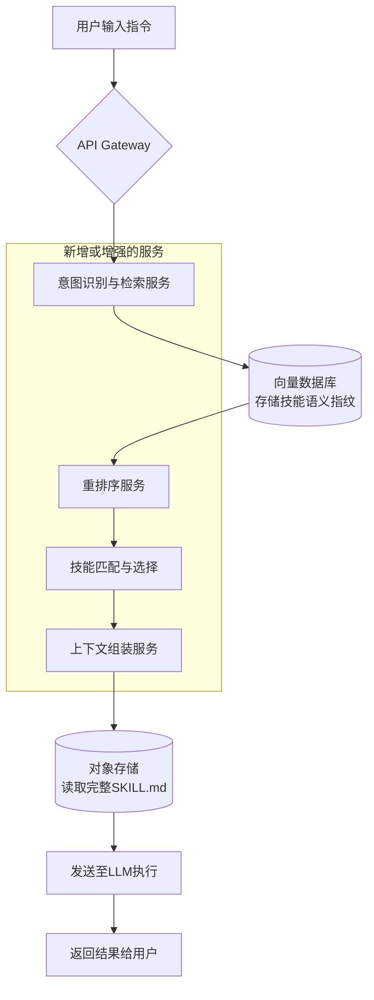

简单来说，你想构建的是一个“**智能技能路由器（Intelligent Skill Router）** ”：它能听懂用户的话，然后从成千上万个技能中，精准地挑选出最适合的那一个（或几个），并在合适的时机交给AI去执行。

---

### 🧠 为什么需要“智能技能路由器”？

当一个AI系统拥有海量技能时，不能把它们一次性全塞给大模型，主要有两个原因：

*   **上下文窗口限制**：一个复杂技能的文档可能有数千个token，成千上万个技能会瞬间塞爆AI的“短期记忆”（上下文窗口）。
*   **AI的“选择困难症”**：当选项过多时，AI反而难以做出正确决策，容易选错工具，导致任务失败。

目前主流的解决方案是“**渐进式披露（Progressive Disclosure）** ”，即只让AI看到所有技能的“名字”和“简介”，在需要时才加载“完整说明书”。

然而，一个新的挑战出现了：仅凭技能作者写的那一小段文字介绍（即元数据），真的足以让AI每次都做出完美的选择吗？

近期的一项研究 **SkillRouter** 发现，在很多情况下，技能真正的“核心机密”藏在它的实现代码或详细文档（body）里，光看简介（metadata）可能会**选错**。这就好比看了电影简介觉得是喜剧，看完才发现是悲剧。

---

### 🛠️ 如何构建这个“智能路由器”？

构建这个智能路由器，本质上是要建立一个强大的“技能搜索引擎”。可以按以下三层架构来设计：

#### 第一步：意图识别与初步检索（粗筛）

当用户输入“帮我分析下这个Excel表格里的销售趋势”，系统首先要理解用户想做什么，然后从技能库中捞出一批“候选人”。

*   **技术实现**：
    1.  **语义向量检索**：将所有技能的名称和简介转化为“语义指纹”（embeddings）存入向量数据库。用户提问时，同样计算其“语义指纹”，通过向量相似度搜索，快速找到意思最接近的一批技能。
    2.  **关键词检索 (BM25)**：同时使用传统的全文检索引擎（如Elasticsearch），用关键词匹配作为补充，确保不遗漏包含“Excel”、“趋势”等具体术语的技能。

#### 第二步：深度匹配与精准排序（精排）

这是最关键的一步。对于粗筛出来的候选技能，系统需要更深入地理解用户意图与技能能力的匹配度。

*   **技术实现**：
    1.  **重排序模型 (Re-ranker)**：使用一个更精准、但计算成本稍高的模型（如`bge-reranker-v2-m3`），对候选技能进行重新打分和排序。这个模型可以更好地处理复杂的语义关系。
    2.  **增强语义索引**：这是解决上述“元数据欺骗”问题的核心。在构建技能索引时，不能只索引技能的`description`，更需要用LLM自动提取技能`body`中的关键步骤、能力、工具，将它们作为隐藏的、增强的索引字段。
    3.  **知识图谱辅助**：可以为技能之间建立关系图谱。例如，完成“发送周报”这个任务，可能需要先执行“查询数据”和“生成图表”这两个技能。知识图谱能帮助系统理解这种工作流依赖，做出更优选择。

#### 第三步：上下文组装与动态加载

系统根据排序结果，组装出一个最优的提示词上下文（Prompt Context）。

*   **技术实现**：
    1.  **按需加载**：仅将得分最高的1-2个技能的完整`SKILL.md`内容注入到发送给LLM的提示词中，其余候选技能的简介可作为备选列出。
    2.  **指令压缩**：如果技能文档本身很长，可以使用类似 **SkillReducer** 的技术，自动压缩指令中的冗余部分，只保留最核心的、能指导AI行动的部分。这能进一步节省宝贵的token。

---

### 🚀 功能流程与产品架构设计

以下是这个“智能技能路由”功能在你的产品中的完整工作流程：

---

### 🎯 对你的项目意味着什么？

引入这项功能，将为你的产品带来巨大的差异化优势：

1.  **从“应用商店”升级为“AI调度中心”**
    你的平台将不再只是一个被动的技能列表，而是能够主动理解用户意图、智能分派任务的“大脑”。这将大大降低用户的使用门槛。

2.  **构建全新的核心业务层**
    你的后端架构需要新增或增强以下服务：
    *   **语义索引服务**：在技能同步入库时，自动生成并存储其向量。
    *   **智能路由服务**：封装上述整个“粗筛 -> 精排”的逻辑。
    *   **上下文组装服务**：根据路由结果，按需加载并组装最终的提示词。

3.  **定义全新的API，创造商业模式**
    这可以成为你未来最高价值的API。可以推出一个新的API端点：

    *   **`POST /api/v1/router/execute`**
        *   **输入**：用户自然语言指令。
        *   **处理**：内部调用智能路由服务，找到最匹配的技能，并执行它。
        *   **输出**：直接返回任务的最终执行结果。

    这种“意图直达结果”的API，可以让任何应用轻松集成最强大的AI能力，市场价值巨大。

4.  **与IDE插件联动，实现场景化推荐**
    你的VS Code插件将变得更加智能。可以根据用户当前打开的文件类型（如`.py`）、光标上下文（如选中的代码块），主动推荐最相关的技能，如“重构此代码”、“解释这段SQL”等，极大地提升开发体验。

### 💎 总结与开发建议

增加智能路由功能，是让你的项目从“**内容聚合平台**”迈向“**智能服务平台**”的关键一步。

建议采用“**三步走**”的开发策略：

1.  **V1.0 (MVP) - 打基础**：引入向量数据库，对所有技能进行语义索引。实现一个基础的`/api/v1/skills/search`语义搜索接口，快速验证价值。
2.  **V2.0 - 提升精度**：引入重排序模型，并让LLM辅助提取技能文档的深层特征，构建增强索引。优化排序效果。
3.  **V3.0 - 形成闭环**：推出`/api/v1/router/execute`执行级API，实现“意图直达结果”。并集成到IDE插件，提供场景化推荐。

这个功能会让你在众多竞品中脱颖而出，成为真正懂得用户意图的AI技能调度中心。